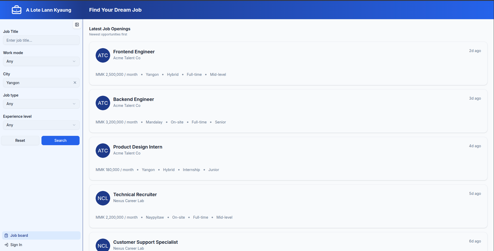
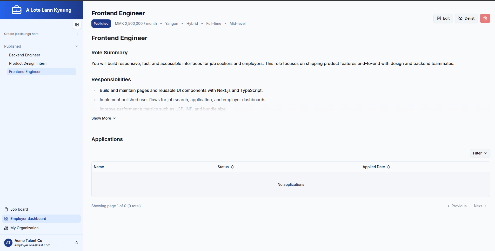
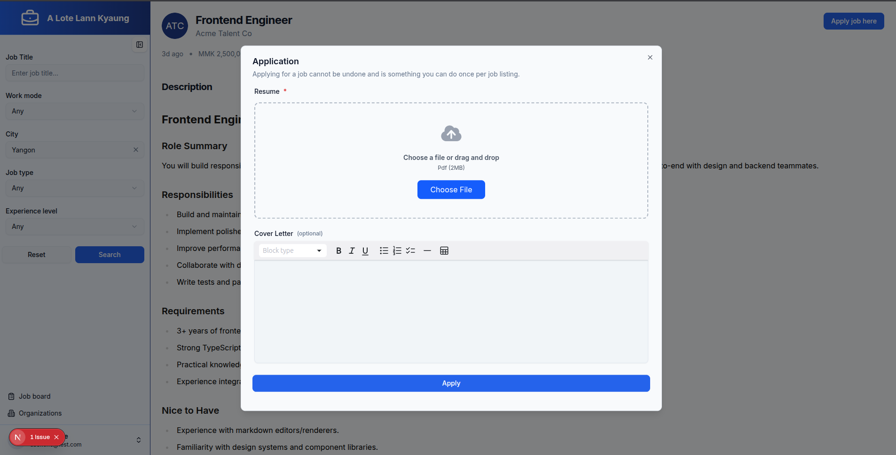
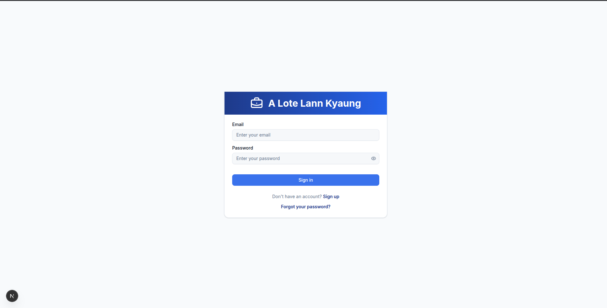
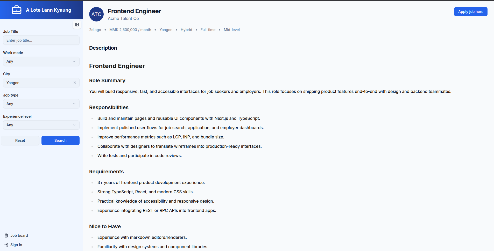
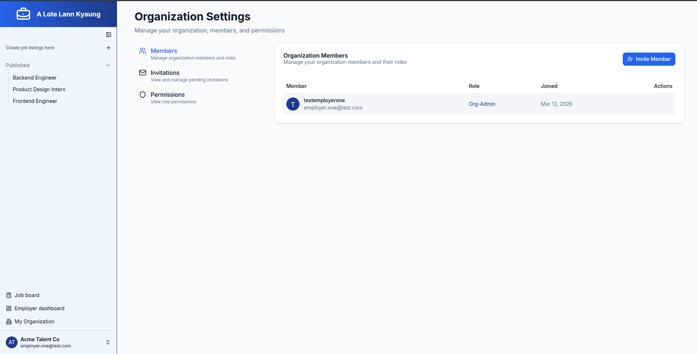
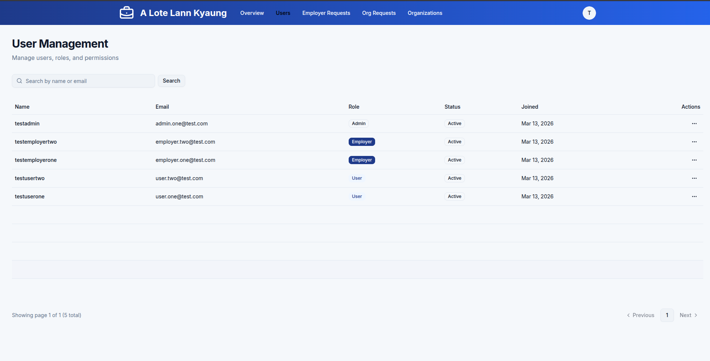
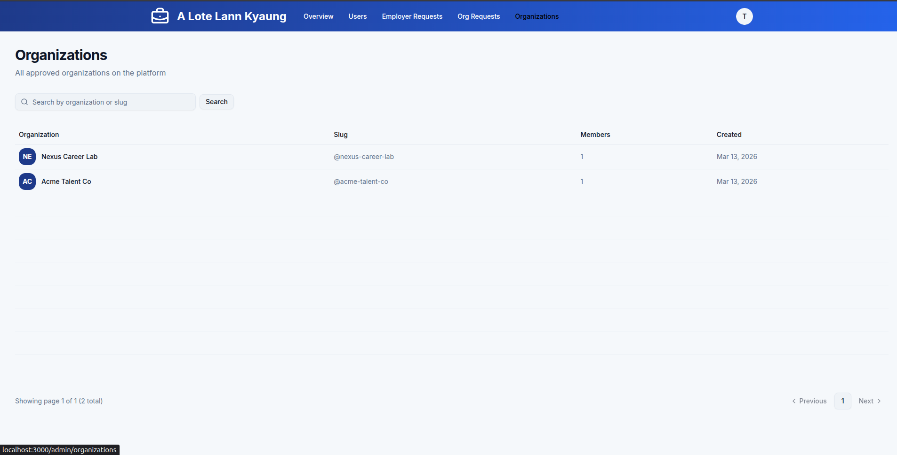

# A-lote-lann-kyaung

A modern full-stack hiring platform built with **Next.js**, **Drizzle ORM**, **PostgreSQL**, and **Better Auth**.

The platform is designed for three types of users:

- **Job Seekers** — Browse and apply for jobs
- **Employers** — Manage organizations, job listings, applications, and team members
- **Administrators** — Review organization requests and manage the platform

**Live Demo:** https://a-lote-lan-kyaung.vercel.app

---

## Features

- Browse and search job listings
- Apply for jobs
- Organization management
- Team member invitations and role management
- Organization claim workflow
- Notification system
- Admin dashboard
- User management
- Authentication & Role-Based Access Control (RBAC)

---

## Tech Stack

| Category | Technology |
|----------|------------|
| Framework | Next.js 16 (App Router) |
| Language | TypeScript |
| Database | PostgreSQL |
| ORM | Drizzle ORM |
| Authentication | Better Auth |
| Styling | Tailwind CSS |
| UI Components | shadcn/ui |
| File Uploads | UploadThing |
| Rich Text Editor | MDXEditor |

---

## Project Structure

The project follows a **feature-based architecture**.

```text
app/          Next.js routes
features/     Business logic by feature
components/   Shared UI components
lib/          Shared utilities
services/     External services
drizzle/      Database schema and migrations
docs/         Documentation
```

For a detailed explanation, see:

- [ARCHITECTURE.md](./docs/ARCHITECTURE.md)

---

## Screenshots

> More features are available in the project.

<p align="center">
  
  
</p>

<p align="center">
  
  
</p>

<p align="center">
  
  
</p>

<p align="center">
  
  
</p>

---

## Project Documentation

Additional documentation is available in the [`docs`](./docs) directory.

- [Architecture](./docs/ARCHITECTURE.md)
- [Project Diagram (PDF)](./docs/a-lote-lann-kyaung.drawio.pdf)
- [Project Diagram (Draw.io)](./docs/a-lote-lann-kyaung.drawio)

---

# Getting Started

## 1. Clone the repository

```bash
git clone https://github.com/thureinhtet99/a-lote-lan-kyaung.git
cd a-lote-lan-kyaung
```

## 2. Install dependencies

```bash
npm install
```

## 3. Configure environment variables

Copy the example environment file.

```bash
cp .env.example .env
```

Required variables:

```env
DATABASE_URL=
BETTER_AUTH_SECRET=
BETTER_AUTH_BASE_URL=
NEXT_PUBLIC_APP_URL=
UPLOADTHING_TOKEN=

SEED_ADMIN_EMAIL=
SEED_ADMIN_NAME=
SEED_ADMIN_PASSWORD=
```

Generate a Better Auth secret with either:

```bash
openssl rand -base64 32
```

or from the Better Auth documentation:

https://better-auth.com/docs/installation

---

## 4. Prepare the database

Generate migrations, apply them, and seed the database.

```bash
npm run db:generate
npm run db:migrate
npm run db:seed
```

The seed command creates default users, organizations, and sample job listings for local development.

---

## 5. Start the development server

```bash
npm run dev
```

Visit:

```
http://localhost:3000
```

---

# Available Scripts

| Command | Description |
|---------|-------------|
| `npm run dev` | Start the development server |
| `npm run build` | Build the application for production |
| `npm run lint` | Run ESLint |
| `npm run db:generate` | Generate Drizzle migrations |
| `npm run db:migrate` | Apply database migrations |
| `npm run db:seed` | Seed the database |
| `npm run db:studio` | Open Drizzle Studio |
| `npm run detect` | Run Knip to detect unused files, exports, and dependencies |
